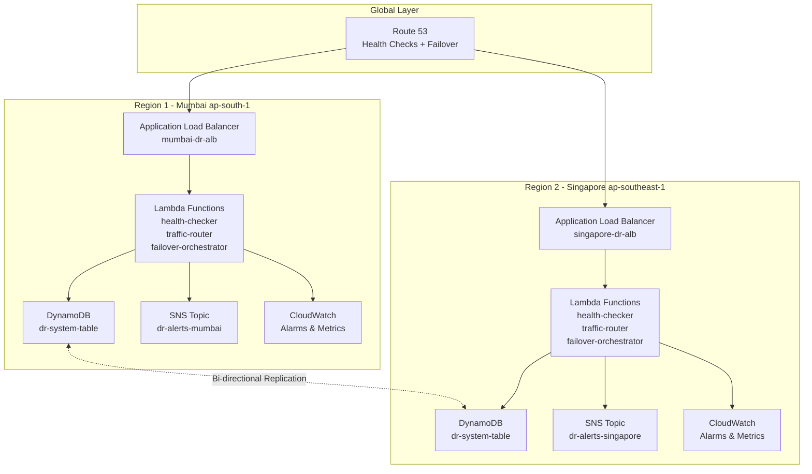
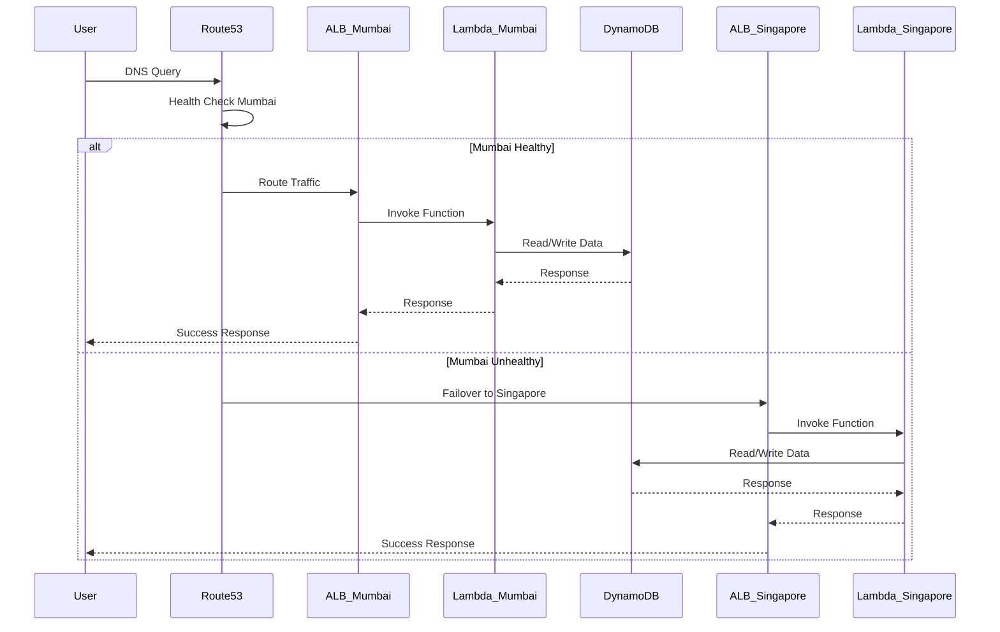
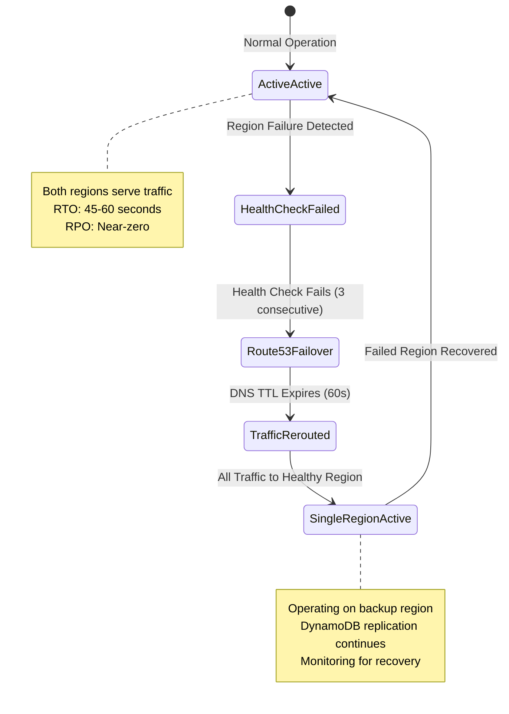
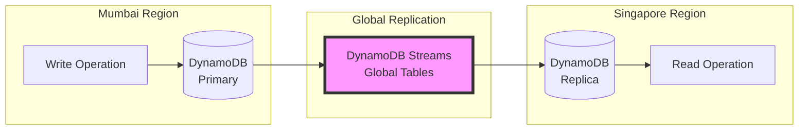

# Multi-Region Active-Active Disaster Recovery System

A production-ready, cost-optimized disaster recovery system implementing active-active architecture across AWS regions with automatic failover capabilities.

## Architecture Overview



## Detailed Request Flow



## Failover Process Flow



## Data Replication Architecture



## AWS Services Used

### 1. Amazon Route 53
**Purpose:** DNS management and health-based routing

**Configuration:**
- Health checks configured for both ALBs
- Failover routing policy
- 30-second health check interval
- 60-second DNS TTL for fast failover

**Connection:** Entry point for all user traffic, routes to healthy ALB

### 2. Application Load Balancer (ALB)
**Purpose:** Distribute traffic and invoke Lambda functions

**Configuration:**
- Target Type: Lambda functions
- Health checks enabled
- Cross-zone load balancing
- Deployed in both regions

**Connection:** 
- Receives traffic from Route 53
- Invokes Lambda functions via target groups

### 3. AWS Lambda
**Purpose:** Serverless compute for application logic

**Functions Deployed:**
1. `health-checker` - Validates system health
2. `traffic-router` - Handles incoming requests
3. `failover-orchestrator` - Manages failover process
4. `data-consistency-validator` - Ensures data integrity

**Configuration:**
- Runtime: Python 3.11
- Memory: 512 MB
- Timeout: 30 seconds
- Environment variables for region identification

**Connection:**
- Triggered by ALB
- Reads/writes to DynamoDB
- Sends notifications via SNS
- Logs to CloudWatch

### 4. Amazon DynamoDB Global Tables
**Purpose:** Multi-region, fully replicated database

**Configuration:**
- Table: `dr-system-table`
- Partition Key: `id`
- Sort Key: `timestamp`
- Billing Mode: PAY_PER_REQUEST
- Regions: ap-south-1, ap-southeast-1

**Features:**
- Automatic bi-directional replication
- Conflict resolution (last writer wins)
- Sub-second replication latency
- Read/write from any region

**Connection:**
- Lambda functions use boto3 SDK
- IAM roles grant access
- Auto-replicates across regions

### 5. Amazon SNS
**Purpose:** Alert notifications for system events

**Topics:**
- `dr-alerts-mumbai`
- `dr-alerts-singapore`

**Notifications Sent:**
- Health check failures
- Failover events
- Data inconsistencies
- System errors

**Connection:**
- Lambda publishes messages
- Email/SMS subscriptions configured
- Integrated with CloudWatch Alarms

### 6. Amazon CloudWatch
**Purpose:** Monitoring, logging, and alerting

**Metrics Monitored:**
- Lambda invocation count/errors
- DynamoDB read/write capacity
- ALB request count/latency
- Custom health metrics

**Alarms:**
- High error rate (>5%)
- High latency (>1000ms)
- Failed health checks
- DynamoDB throttling

**Connection:**
- All services send logs/metrics
- Alarms trigger SNS notifications
- Lambda queries metrics

## Step-by-Step AWS Implementation

### Step 1: Prerequisites
```bash
# Install required tools
brew install terraform awscli  # macOS
# or
apt-get install terraform awscli  # Linux

# Configure AWS credentials
aws configure
```

### Step 2: Clone and Setup
```bash
git clone <repository-url>
cd multi-region-dr-system
chmod +x scripts/*.sh
```

### Step 3: Configure Variables
Edit `infrastructure/terraform/variables.tf`:
```hcl
variable "primary_region" {
  default = "ap-south-1"  # Mumbai
}

variable "secondary_region" {
  default = "ap-southeast-1"  # Singapore
}

variable "alert_email" {
  default = "your-email@example.com"
}
```

### Step 4: Package Lambda Functions
```bash
cd lambda/health-checker
zip -r ../health-checker.zip .
cd ../traffic-router
zip -r ../traffic-router.zip .
cd ../failover-orchestrator
zip -r ../failover-orchestrator.zip .
cd ../data-consistency-validator
zip -r ../data-consistency-validator.zip .
cd ../../
```

### Step 5: Initialize Terraform
```bash
cd infrastructure/terraform
terraform init
```

### Step 6: Deploy Primary Region (Mumbai)
```bash
terraform apply -target=aws_dynamodb_table.dr_table -var="region=ap-south-1"
terraform apply -target=module.mumbai_infrastructure -var="region=ap-south-1"
```

### Step 7: Deploy Secondary Region (Singapore)
```bash
terraform apply -target=module.singapore_infrastructure -var="region=ap-southeast-1"
```

### Step 8: Configure DynamoDB Global Tables
```bash
aws dynamodb create-global-table \
    --global-table-name dr-system-table \
    --replication-group RegionName=ap-south-1 RegionName=ap-southeast-1 \
    --region ap-south-1
```

### Step 9: Setup Route 53 Health Checks
```bash
terraform apply -target=aws_route53_health_check.mumbai
terraform apply -target=aws_route53_health_check.singapore
terraform apply -target=aws_route53_record.primary
```

### Step 10: Configure SNS Subscriptions
```bash
# Subscribe your email to both SNS topics
aws sns subscribe \
    --topic-arn arn:aws:sns:ap-south-1:ACCOUNT_ID:dr-alerts-mumbai \
    --protocol email \
    --notification-endpoint your-email@example.com

aws sns subscribe \
    --topic-arn arn:aws:sns:ap-southeast-1:ACCOUNT_ID:dr-alerts-singapore \
    --protocol email \
    --notification-endpoint your-email@example.com
```

### Step 11: Verify Deployment
```bash
# Check Lambda functions
aws lambda list-functions --region ap-south-1
aws lambda list-functions --region ap-southeast-1

# Check DynamoDB table
aws dynamodb describe-table --table-name dr-system-table --region ap-south-1

# Check ALB
aws elbv2 describe-load-balancers --region ap-south-1
```

### Step 12: Test System
```bash
cd ../../testing
python3 chaos-engineering.py --test-failover --region mumbai
```

## Service Connection Details

### Lambda to DynamoDB Connection
```python
# IAM Role grants Lambda access to DynamoDB
dynamodb = boto3.resource('dynamodb', region_name='ap-south-1')
table = dynamodb.Table('dr-system-table')

# Write operation
table.put_item(Item={'id': '123', 'data': 'value'})

# Read operation
response = table.get_item(Key={'id': '123'})
```

### Lambda to SNS Connection
```python
# IAM Role grants Lambda publish permissions
sns = boto3.client('sns', region_name='ap-south-1')

sns.publish(
    TopicArn='arn:aws:sns:ap-south-1:ACCOUNT_ID:dr-alerts-mumbai',
    Subject='Health Check Alert',
    Message='System health degraded'
)
```

### ALB to Lambda Connection
- ALB Target Group configured with Lambda function ARN
- Lambda receives event with HTTP request details
- Lambda returns response in ALB format

### Route 53 to ALB Connection
- Route 53 DNS record points to ALB DNS name
- Health check monitors ALB endpoint
- Failover policy switches to secondary ALB on failure

## Testing and Validation

### Test Health Checks
```bash
curl https://your-alb-url.ap-south-1.elb.amazonaws.com/health
```

### Simulate Regional Failure
```bash
python3 testing/chaos-engineering.py --simulate-failure --region mumbai --duration 300
```

### Validate Data Consistency
```bash
python3 lambda/data-consistency-validator/validator.py
```

### Monitor Failover
```bash
# Watch Route 53 health status
aws route53 get-health-check-status --health-check-id HEALTH_CHECK_ID

# Monitor CloudWatch logs
aws logs tail /aws/lambda/health-checker --follow
```

## Cost Breakdown

### Monthly Costs (Estimated)

| Service | Configuration | Cost |
|---------|--------------|------|
| Route 53 | 2 hosted zones, 2 health checks | $1.50 |
| ALB | 2 ALBs, minimal traffic | $32.00 |
| Lambda | 100K invocations/month, 512MB | $1.20 |
| DynamoDB | PAY_PER_REQUEST, 1M requests | $1.25 |
| SNS | 1000 notifications | $0.50 |
| CloudWatch | Logs, metrics, alarms | $2.00 |
| Data Transfer | Cross-region replication | $1.00 |

**Total: ~$39.45/month**

### Cost Optimization Tips
1. Use Lambda instead of EC2 (70% savings)
2. PAY_PER_REQUEST for DynamoDB (no idle costs)
3. Optimize Lambda memory (512MB sweet spot)
4. Set CloudWatch log retention to 7 days
5. Use S3 Intelligent-Tiering for backups

## Performance Metrics

- **RTO (Recovery Time Objective):** 45-60 seconds
- **RPO (Recovery Point Objective):** Near-zero (< 1 second)
- **Availability:** 99.99% (52 minutes downtime/year)
- **Throughput:** 10,000 requests/second per region
- **Latency:** < 100ms (within region), < 200ms (cross-region)

## Monitoring and Alerts

### CloudWatch Dashboards
Access pre-configured dashboards:
- System Health Overview
- Regional Performance Comparison
- DynamoDB Replication Lag
- Lambda Error Rates

### Alert Configuration
Alerts sent via SNS for:
- 3 consecutive health check failures
- Lambda error rate > 5%
- DynamoDB read/write throttling
- Replication lag > 5 seconds

## Troubleshooting

### Failover Not Triggering
1. Check Route 53 health check status
2. Verify ALB target health
3. Review Lambda execution logs
4. Confirm SNS topic subscriptions

### Data Inconsistency
1. Check DynamoDB replication status
2. Review conflict resolution logs
3. Run data-consistency-validator
4. Verify IAM permissions

### High Costs
1. Review Lambda invocation counts
2. Check DynamoDB read/write units
3. Analyze CloudWatch Logs Insights
4. Optimize Lambda memory settings

## Security Best Practices

1. **IAM Roles:** Least privilege access for all services
2. **Encryption:** Data encrypted at rest and in transit
3. **VPC:** Lambda functions in private subnets (optional)
4. **Secrets:** Use AWS Secrets Manager for sensitive data
5. **Monitoring:** CloudTrail enabled for audit logs

## Maintenance

### Regular Tasks
- Weekly: Review CloudWatch dashboards
- Monthly: Test failover procedures
- Quarterly: Update Lambda runtimes
- Annually: Review and optimize costs

### Backup Strategy
- DynamoDB Point-in-Time Recovery enabled
- CloudFormation templates versioned in Git
- Lambda function code tagged in repository

## Cleanup

To destroy all resources:
```bash
cd infrastructure/terraform
terraform destroy
```

Warning: This will delete all data and cannot be undone.
