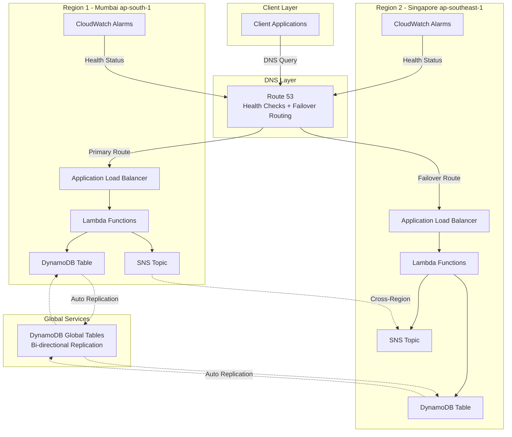
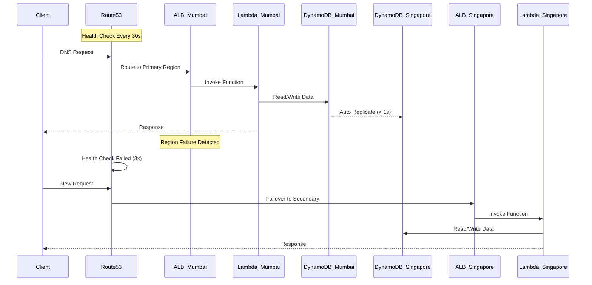
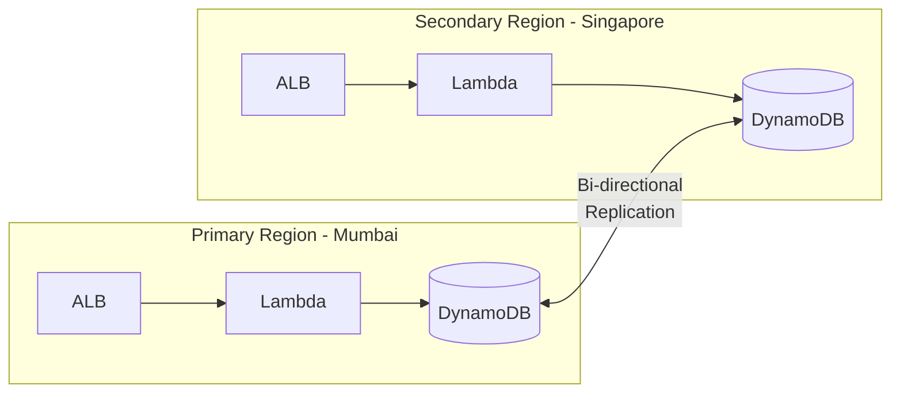

# Multi-Region Active-Active Disaster Recovery System

A production-ready disaster recovery system built on AWS, providing automatic failover between Mumbai (ap-south-1) and Singapore (ap-southeast-1) regions with near-zero data loss and sub-60 second recovery time objective (RTO).

## Table of Contents

- [Architecture Overview](#architecture-overview)
- [System Components](#system-components)
- [Prerequisites](#prerequisites)
- [Project Structure](#project-structure)
- [Step-by-Step Setup Guide](#step-by-step-setup-guide)
- [Testing the System](#testing-the-system)
- [Monitoring and Alerts](#monitoring-and-alerts)
- [Maintenance and Operations](#maintenance-and-operations)
- [Cost Analysis](#cost-analysis)
- [Troubleshooting](#troubleshooting)
- [FAQ](#faq)

## Architecture Overview

### High-Level Architecture



### Failover Sequence



### Data Flow Architecture



## System Components

### AWS Services Used

**Route 53**
- Global DNS service with health checking and failover routing
- Configuration: Failover routing policy with health checks every 30 seconds
- Cost: $0.50/month per health check + $0.50/million queries
- Purpose: Automatically redirects traffic to healthy region

**Application Load Balancer (ALB)**
- Distributes incoming HTTPS traffic to Lambda functions
- Deployed in both Mumbai and Singapore regions
- Includes SSL/TLS termination with ACM certificates
- Health checks every 30 seconds on /health endpoint
- Cost: Approximately $16/month per region

**AWS Lambda**
- Serverless compute for application logic
- Four function types deployed per region:
  - health-checker: Validates system health metrics
  - traffic-router: Handles API requests (GET, POST, PUT, DELETE)
  - failover-orchestrator: Manages failover procedures
  - data-consistency-validator: Ensures data integrity
- Runtime: Python 3.9
- Memory: 256 MB per function
- Cost: First 1M requests free, then $0.20 per 1M requests

**DynamoDB Global Tables**
- Multi-region, fully replicated NoSQL database
- Replica tables in Mumbai and Singapore with automatic bi-directional replication
- Replication lag: Typically under 1 second
- On-demand billing mode for cost optimization
- Point-in-time recovery enabled
- Server-side encryption enabled
- Cost: $1.25 per million write request units

**SNS (Simple Notification Service)**
- Alert notifications and cross-region event propagation
- Topics in both regions for operational alerts
- Email subscriptions for incident notifications
- Cost: First 1M notifications free

**CloudWatch**
- Monitoring, logging, and alerting for all services
- Custom metrics for RTO, RPO, and data consistency
- Alarms for Lambda errors, DynamoDB throttles, health check failures
- Log retention: 7 days
- Cost: Approximately $3/month

## Prerequisites

### Required Tools

1. **AWS Account**
   - Administrative access or IAM user with sufficient permissions
   - Billing alerts configured (recommended)

2. **AWS CLI** (version 2.x)
   ```bash
   # Install on macOS
   brew install awscli
   
   # Install on Ubuntu/Debian
   sudo apt-get install awscli
   
   # Install on Windows
   # Download from: https://aws.amazon.com/cli/
   
   # Verify installation
   aws --version
   ```

3. **Terraform** (version 1.5+)
   ```bash
   # Install on macOS
   brew install terraform
   
   # Install on Ubuntu/Debian
   wget https://releases.hashicorp.com/terraform/1.6.0/terraform_1.6.0_linux_amd64.zip
   unzip terraform_1.6.0_linux_amd64.zip
   sudo mv terraform /usr/local/bin/
   
   # Verify installation
   terraform version
   ```

4. **Python** (version 3.9+)
   ```bash
   # Install on macOS
   brew install python3
   
   # Install on Ubuntu/Debian
   sudo apt-get install python3 python3-pip
   
   # Verify installation
   python3 --version
   pip3 --version
   ```

5. **Git**
   ```bash
   # Install on macOS
   brew install git
   
   # Install on Ubuntu/Debian
   sudo apt-get install git
   
   # Verify installation
   git --version
   ```

### AWS Permissions Required

Create an IAM user or role with these permissions:
- Route53 Full Access
- EC2 Full Access (for VPC, ALB)
- Lambda Full Access
- DynamoDB Full Access
- SNS Full Access
- CloudWatch Full Access
- IAM Limited Access (for creating roles)
- ACM Full Access (for SSL certificates)

### Domain Name

You need a domain name that you can configure with Route 53:
- Purchase from Route 53, GoDaddy, Namecheap, or any registrar
- You'll configure nameservers to point to Route 53
- Example: yourdomain.com

## Project Structure

```
multi-region-dr-system/
├── README.md                          # This file
├── .gitignore                         # Git ignore configuration
├── infrastructure/                    # Infrastructure as Code
│   ├── terraform/                     # Terraform configurations
│   │   ├── main.tf                    # Core infrastructure
│   │   ├── variables.tf               # Input variables
│   │   ├── outputs.tf                 # Output values
│   │   ├── provider.tf                # Provider configuration
│   │   ├── alb.tf                     # Load balancer setup
│   │   ├── dynamodb-global.tf         # Global tables
│   │   ├── lambda-functions.tf        # Lambda definitions
│   │   ├── sns.tf                     # SNS topics and alarms
│   │   ├── iam.tf                     # IAM roles and policies
│   │   └── route53-health-checks.tf   # Health checks
│   └── cloudformation/                # CloudFormation alternative
│       └── dr-stack.yaml              # CF template
├── lambda/                            # Lambda function code
│   ├── health-checker/
│   │   ├── index.py                   # Health check logic
│   │   └── requirements.txt           # Python dependencies
│   ├── failover-orchestrator/
│   │   ├── index.py                   # Failover logic
│   │   └── requirements.txt
│   ├── data-consistency-validator/
│   │   ├── index.py                   # Data validation
│   │   └── requirements.txt
│   └── traffic-router/
│       ├── index.py                   # API request handler
│       └── requirements.txt
├── monitoring/                        # Monitoring configurations
│   ├── cloudwatch-alarms.yaml         # CloudWatch alarms
│   └── sns-notifications.tf           # SNS automation
├── testing/                           # Testing scripts
│   ├── chaos-engineering.py           # Failure simulation
│   ├── rto-calculator.py              # RTO measurement
│   └── data-integrity-tests.py        # Data validation
└── scripts/                           # Deployment scripts
    ├── deploy.sh                      # Main deployment
    ├── rollback.sh                    # Rollback procedures
    └── test-failover.sh               # Failover testing
```

## Step-by-Step Setup Guide

### Phase 1: Initial Setup (30 minutes)

#### Step 1: Clone the Repository

```bash
# Clone the project
git clone <your-repository-url>
cd multi-region-dr-system

# Verify all files are present
ls -la
```

#### Step 2: Configure AWS Credentials

```bash
# Configure AWS CLI with your credentials
aws configure

# Enter your credentials when prompted:
# AWS Access Key ID: YOUR_ACCESS_KEY
# AWS Secret Access Key: YOUR_SECRET_KEY
# Default region name: ap-south-1
# Default output format: json

# Test the configuration
aws sts get-caller-identity
```

You should see output with your AWS account ID and user ARN.

#### Step 3: Set Up Your Domain in Route 53

```bash
# Option A: If you already have a domain, create a hosted zone
aws route53 create-hosted-zone \
  --name yourdomain.com \
  --caller-reference $(date +%s)

# Note the nameservers from the output
# Update your domain registrar to use these nameservers

# Option B: If you don't have a domain, register one through Route 53
# Go to AWS Console > Route 53 > Register Domain
```

#### Step 4: Configure Terraform Variables

Create a file `infrastructure/terraform/terraform.tfvars`:

```bash
cd infrastructure/terraform
cat > terraform.tfvars << EOF
domain_name          = "yourdomain.com"
notification_email   = "your-email@example.com"
primary_region       = "ap-south-1"
secondary_region     = "ap-southeast-1"
environment          = "production"
dynamodb_table_name  = "dr-application-data"
EOF
```

Replace `yourdomain.com` and `your-email@example.com` with your actual values.

### Phase 2: Lambda Function Preparation (15 minutes)

#### Step 5: Package Lambda Functions

```bash
# Navigate to lambda directory
cd ../../lambda

# Package health-checker
cd health-checker
pip3 install -r requirements.txt -t .
zip -r ../health-checker.zip .
cd ..

# Package traffic-router
cd traffic-router
pip3 install -r requirements.txt -t .
zip -r ../traffic-router.zip .
cd ..

# Package failover-orchestrator
cd failover-orchestrator
pip3 install -r requirements.txt -t .
zip -r ../failover-orchestrator.zip .
cd ..

# Package data-consistency-validator
cd data-consistency-validator
pip3 install -r requirements.txt -t .
zip -r ../data-consistency-validator.zip .
cd ..

# Verify all zip files are created
ls -lh *.zip
```

You should see four .zip files created.

### Phase 3: Infrastructure Deployment (45 minutes)

#### Step 6: Initialize Terraform

```bash
# Navigate to terraform directory
cd ../infrastructure/terraform

# Initialize Terraform (downloads providers)
terraform init
```

Expected output: "Terraform has been successfully initialized!"

#### Step 7: Validate Configuration

```bash
# Validate the Terraform configuration
terraform validate
```

Expected output: "Success! The configuration is valid."

#### Step 8: Plan the Deployment

```bash
# Create an execution plan
terraform plan -out=tfplan

# Review the output carefully
# You should see resources to be created in both regions
```

Review the plan output. You should see approximately 50-60 resources to be created including:
- 2 VPCs (Mumbai and Singapore)
- 4 Subnets per region
- 2 ALBs
- 4 Lambda functions per region
- 1 DynamoDB Global Table
- 2 SNS Topics
- Multiple IAM roles and policies
- Route 53 records and health checks

#### Step 9: Deploy Infrastructure

```bash
# Apply the Terraform plan
terraform apply tfplan

# This will take 10-15 minutes
# Watch for any errors in the output
```

IMPORTANT: During deployment, you may see warnings about ACM certificate validation. This is normal. The certificates need DNS validation which happens automatically.

#### Step 10: Verify Deployment

```bash
# Check if resources were created successfully
terraform output

# You should see outputs including:
# - mumbai_alb_dns
# - singapore_alb_dns
# - primary_endpoint
# - dynamodb_table_name
# - route53_nameservers
```

Save these outputs - you'll need them for testing.

### Phase 4: Post-Deployment Configuration (20 minutes)

#### Step 11: Confirm SNS Email Subscriptions

1. Check your email inbox for two subscription confirmation emails from AWS SNS
2. Open each email and click "Confirm subscription"
3. You should receive confirmations for both Mumbai and Singapore topics

Verify subscriptions:
```bash
aws sns list-subscriptions \
  --region ap-south-1 \
  --query 'Subscriptions[?Protocol==`email`]'
```

#### Step 12: Verify DynamoDB Global Table Replication

```bash
# Check Mumbai table
aws dynamodb describe-table \
  --table-name dr-application-data \
  --region ap-south-1 \
  --query 'Table.[TableName,TableStatus,Replicas]'

# Check Singapore replica
aws dynamodb describe-table \
  --table-name dr-application-data \
  --region ap-southeast-1 \
  --query 'Table.[TableName,TableStatus]'
```

Both should show "ACTIVE" status.

#### Step 13: Verify Lambda Functions

```bash
# List Lambda functions in Mumbai
aws lambda list-functions \
  --region ap-south-1 \
  --query 'Functions[?starts_with(FunctionName, `health-checker`) || starts_with(FunctionName, `traffic-router`)].FunctionName'

# List Lambda functions in Singapore
aws lambda list-functions \
  --region ap-southeast-1 \
  --query 'Functions[?starts_with(FunctionName, `health-checker`) || starts_with(FunctionName, `traffic-router`)].FunctionName'
```

You should see 2 functions per region (health-checker and traffic-router).

#### Step 14: Verify ALB Health

```bash
# Get Mumbai ALB DNS name
MUMBAI_ALB=$(terraform output -raw mumbai_alb_dns)

# Get Singapore ALB DNS name
SINGAPORE_ALB=$(terraform output -raw singapore_alb_dns)

# Test Mumbai ALB
curl -k https://$MUMBAI_ALB/health

# Test Singapore ALB
curl -k https://$SINGAPORE_ALB/health
```

Both should return: `{"status":"healthy","region":"...","timestamp":"..."}`

#### Step 15: Configure DNS (If Not Using Route 53 Registrar)

If your domain is registered outside Route 53:

```bash
# Get Route 53 nameservers
terraform output route53_nameservers

# Update your domain registrar's nameserver settings to use these
```

At your domain registrar (GoDaddy, Namecheap, etc.):
1. Log in to your account
2. Find DNS settings for your domain
3. Replace existing nameservers with the Route 53 nameservers
4. Save changes (propagation takes 24-48 hours, but often works within 1 hour)

### Phase 5: Testing and Validation (30 minutes)

#### Step 16: Test Basic Functionality

```bash
# Wait for DNS propagation (check with)
nslookup api.yourdomain.com

# Once resolved, test the endpoint
curl https://api.yourdomain.com/health
```

Expected response: `{"status":"healthy","region":"ap-south-1","timestamp":"..."}`

#### Step 17: Test Data Operations

```bash
# Create a test item
curl -X POST https://api.yourdomain.com/ \
  -H "Content-Type: application/json" \
  -d '{"data": {"name": "Test Item", "value": 123}}'

# Retrieve all items
curl https://api.yourdomain.com/

# You should see your test item in the response
```

#### Step 18: Run Data Integrity Tests

```bash
cd ../../testing

# Install test dependencies
pip3 install boto3 requests

# Run data integrity tests
python3 data-integrity-tests.py \
  --table-name dr-application-data \
  --primary-region ap-south-1 \
  --secondary-region ap-southeast-1
```

Expected output: All tests should PASS with replication times under 1000ms.

#### Step 19: Measure RTO (Optional - Requires Manual Intervention)

```bash
# Run RTO calculator
python3 rto-calculator.py \
  --primary-endpoint $MUMBAI_ALB \
  --secondary-endpoint $SINGAPORE_ALB \
  --test-failover
```

Follow the prompts to simulate a failure and measure recovery time.

#### Step 20: Test Automated Failover

```bash
cd ../scripts
chmod +x test-failover.sh

# Run failover test (requires your domain name)
./test-failover.sh yourdomain.com
```

This script will:
1. Verify both regions are healthy
2. Simulate primary region failure
3. Monitor failover progress
4. Measure RTO
5. Generate a test report

## Testing the System

### Manual Testing

#### Test 1: Health Check Validation

```bash
# Test Mumbai region
curl -k https://$MUMBAI_ALB/health

# Test Singapore region
curl -k https://$SINGAPORE_ALB/health

# Test via Route 53 (your domain)
curl https://api.yourdomain.com/health
```

All should return HTTP 200 with healthy status.

#### Test 2: CRUD Operations

```bash
# Create
ITEM_ID=$(curl -X POST https://api.yourdomain.com/ \
  -H "Content-Type: application/json" \
  -d '{"data": {"name": "Product A", "price": 99.99}}' | jq -r '.id')

# Read specific item
curl "https://api.yourdomain.com/?id=$ITEM_ID"

# Update
curl -X PUT https://api.yourdomain.com/ \
  -H "Content-Type: application/json" \
  -d "{\"id\": \"$ITEM_ID\", \"data\": {\"name\": \"Product A\", \"price\": 89.99}}"

# Delete
curl -X DELETE "https://api.yourdomain.com/?id=$ITEM_ID"
```

#### Test 3: Cross-Region Data Replication

```bash
# Write to Mumbai
curl -X POST https://$MUMBAI_ALB/ \
  -H "Content-Type: application/json" \
  -d '{"data": {"test": "mumbai-write"}}' | jq -r '.id' > item_id.txt

# Wait 2 seconds for replication
sleep 2

# Read from Singapore
curl "https://$SINGAPORE_ALB/?id=$(cat item_id.txt)"
```

You should see the same data in Singapore that was written to Mumbai.

### Automated Testing

#### Run Complete Test Suite

```bash
cd testing

# Run all data integrity tests
python3 data-integrity-tests.py

# Expected results:
# - Write Replication: PASS
# - Bi-directional Replication: PASS
# - Concurrent Writes: PASS
# - Read Consistency: PASS
```

#### Chaos Engineering Test

```bash
# Simulate region failure
python3 chaos-engineering.py \
  --region ap-south-1 \
  --alb-name mumbai-alb \
  --endpoint api.yourdomain.com \
  --simulate-failure

# This will:
# 1. Deregister targets from Mumbai ALB
# 2. Measure failover time
# 3. Collect metrics
# 4. Generate report
```

## Monitoring and Alerts

### CloudWatch Dashboards

Access your CloudWatch dashboards:

```bash
# Mumbai dashboard
https://console.aws.amazon.com/cloudwatch/home?region=ap-south-1#dashboards:

# Singapore dashboard
https://console.aws.amazon.com/cloudwatch/home?region=ap-southeast-1#dashboards:
```

Key metrics to monitor:
- Lambda Invocations and Errors
- DynamoDB Read/Write Capacity
- ALB Request Count and Response Times
- Route 53 Health Check Status

### Setting Up Additional Alarms

Deploy additional CloudWatch alarms:

```bash
cd monitoring

# Deploy to Mumbai
aws cloudformation deploy \
  --template-file cloudwatch-alarms.yaml \
  --stack-name dr-monitoring-mumbai \
  --parameter-overrides \
    SNSTopicArn=<your-mumbai-sns-topic-arn> \
    LambdaFunctionName=traffic-router-mumbai \
  --region ap-south-1

# Deploy to Singapore
aws cloudformation deploy \
  --template-file cloudwatch-alarms.yaml \
  --stack-name dr-monitoring-singapore \
  --parameter-overrides \
    SNSTopicArn=<your-singapore-sns-topic-arn> \
    LambdaFunctionName=traffic-router-singapore \
  --region ap-southeast-1
```

### Alert Types

You will receive email alerts for:

1. **Health Check Failures**
   - Trigger: 3 consecutive failed health checks
   - Action: Automatic failover initiated

2. **Lambda Errors**
   - Trigger: More than 5 errors in 5 minutes
   - Action: Review CloudWatch Logs

3. **DynamoDB Throttling**
   - Trigger: More than 10 throttled requests in 5 minutes
   - Action: Consider increasing capacity

4. **High Replication Lag**
   - Trigger: Replication lag exceeds 5 seconds
   - Action: Investigate network or table issues

5. **Unhealthy ALB Targets**
   - Trigger: Any unhealthy target detected
   - Action: Check Lambda function health

### Viewing Logs

```bash
# View Lambda logs - Mumbai
aws logs tail /aws/lambda/traffic-router-mumbai --follow --region ap-south-1

# View Lambda logs - Singapore
aws logs tail /aws/lambda/traffic-router-singapore --follow --region ap-southeast-1

# View specific time range
aws logs tail /aws/lambda/traffic-router-mumbai \
  --since 1h \
  --region ap-south-1
```

## Maintenance and Operations

### Regular Maintenance Tasks

#### Weekly Tasks

1. **Review CloudWatch Metrics**
   ```bash
   # Check error rates
   aws cloudwatch get-metric-statistics \
     --namespace AWS/Lambda \
     --metric-name Errors \
     --start-time $(date -u -d '7 days ago' +%Y-%m-%dT%H:%M:%S) \
     --end-time $(date -u +%Y-%m-%dT%H:%M:%S) \
     --period 86400 \
     --statistics Sum \
     --region ap-south-1
   ```

2. **Verify Health Check Status**
   ```bash
   aws route53 get-health-check-status \
     --health-check-id <your-health-check-id>
   ```

3. **Check Data Replication Lag**
   ```bash
   python3 testing/data-integrity-tests.py
   ```

#### Monthly Tasks

1. **Update Lambda Dependencies**
   ```bash
   cd lambda/traffic-router
   pip3 install -r requirements.txt --upgrade -t .
   zip -r ../traffic-router.zip .
   
   aws lambda update-function-code \
     --function-name traffic-router-mumbai \
     --zip-file fileb://../traffic-router.zip \
     --region ap-south-1
   ```

2. **Review and Optimize Costs**
   ```bash
   # Check DynamoDB costs
   aws ce get-cost-and-usage \
     --time-period Start=2024-01-01,End=2024-01-31 \
     --granularity MONTHLY \
     --metrics BlendedCost \
     --filter file://dynamodb-filter.json
   ```

3. **Test Failover Procedures**
   ```bash
   ./scripts/test-failover.sh yourdomain.com
   ```

4. **Review Security Groups and IAM Policies**
   ```bash
   # Audit IAM roles
   aws iam get-role --role-name dr-lambda-execution-role
   
   # Review security group rules
   aws ec2 describe-security-groups \
     --filters "Name=tag:Project,Values=Multi-Region-DR" \
     --region ap-south-1
   ```

### Updating the System

#### Update Lambda Function Code

```bash
# Make changes to lambda function
cd lambda/traffic-router
vim index.py

# Package and deploy
pip3 install -r requirements.txt -t .
zip -r ../traffic-router.zip .

# Deploy to both regions
aws lambda update-function-code \
  --function-name traffic-router-mumbai \
  --zip-file fileb://../traffic-router.zip \
  --region ap-south-1

aws lambda update-function-code \
  --function-name traffic-router-singapore \
  --zip-file fileb://../traffic-router.zip \
  --region ap-southeast-1
```

#### Update Infrastructure

```bash
cd infrastructure/terraform

# Make changes to .tf files
vim main.tf

# Plan the changes
terraform plan -out=tfplan

# Review and apply
terraform apply tfplan
```

### Backup and Recovery

#### Manual Backup

```bash
# Create on-demand backup of DynamoDB table
aws dynamodb create-backup \
  --table-name dr-application-data \
  --backup-name dr-backup-$(date +%Y%m%d-%H%M%S) \
  --region ap-south-1
```

#### Restore from Backup

```bash
# List available backups
aws dynamodb list-backups \
  --table-name dr-application-data \
  --region ap-south-1

# Restore from backup
aws dynamodb restore-table-from-backup \
  --target-table-name dr-application-data-restored \
  --backup-arn <backup-arn> \
  --region ap-south-1
```

#### Point-in-Time Recovery

```bash
# Restore to specific time
aws dynamodb restore-table-to-point-in-time \
  --source-table-name dr-application-data \
  --target-table-name dr-application-data-restored \
  --restore-date-time "2024-01-15T10:00:00Z" \
  --region ap-south-1
```

### Rollback Procedures

If deployment fails or issues occur:

```bash
cd scripts

# Run rollback script
./rollback.sh

# Select rollback option:
# 1) Restore Lambda functions only
# 2) Restore DynamoDB from backup
# 3) Restore Route 53 configuration
# 4) Full infrastructure rollback
# 5) All of the above
```

## Cost Analysis

### Monthly Cost Breakdown

| Service | Configuration | Estimated Cost |
|---------|--------------|----------------|
| Route 53 | 2 health checks + DNS queries (1M) | $1.50 |
| ALB (Mumbai) | 730 hours + 1GB processed | $16.00 |
| ALB (Singapore) | 730 hours + 1GB processed | $16.00 |
| Lambda | 1M requests, 256MB, 100ms avg | $2.00 |
| DynamoDB | 1M reads, 500K writes, storage | $5.00 |
| SNS | 100K notifications | $0.50 |
| CloudWatch | Custom metrics + logs | $3.00 |
| Data Transfer | Inter-region replication (1GB) | $2.00 |
| **Total** | | **$46.00** |

### Cost Optimization Tips

1. **Use Reserved Capacity for Predictable Workloads**
   - Switch DynamoDB to provisioned mode if traffic is consistent
   - Potential savings: 40-50%

2. **Implement Intelligent Tiering**
   - Archive old CloudWatch logs to S3
   - Use S3 lifecycle policies

3. **Optimize Lambda Memory**
   ```bash
   # Test different memory configurations
   aws lambda update-function-configuration \
     --function-name traffic-router-mumbai \
     --memory-size 128 \
     --region ap-south-1
   ```

4. **Enable Cost Allocation Tags**
   ```bash
   aws ce create-cost-category-definition \
     --name "DR-System" \
     --rules file://cost-rules.json
   ```

5. **Use Compute Savings Plans**
   - Commit to consistent Lambda usage
   - Potential savings: 10-20%

### Monitoring Costs

```bash
# Get current month costs
aws ce get-cost-and-usage \
  --time-period Start=$(date +%Y-%m-01),End=$(date +%Y-%m-%d) \
  --granularity DAILY \
  --metrics BlendedCost \
  --group-by Type=SERVICE
```

## Troubleshooting

### Common Issues and Solutions

#### Issue 1: Health Checks Failing

**Symptoms:**
- Route 53 health checks report unhealthy
- Traffic not routing correctly

**Diagnosis:**
```bash
# Check health check status
aws route53 get-health-check-status \
  --health-check-id <health-check-id>

# Check ALB target health
aws elbv2 describe-target-health \
  --target-group-arn <target-group-arn> \
  --region ap-south-1
```

**Solutions:**

1. Verify Lambda function is responding:
```bash
aws lambda invoke \
  --function-name traffic-router-mumbai \
  --region ap-south-1 \
  --payload '{"path":"/health","httpMethod":"GET"}' \
  response.json

cat response.json
```

2. Check ALB security group allows traffic on port 443
3. Verify ACM certificate is validated
4. Check Lambda execution role permissions

#### Issue 2: DynamoDB Replication Lag

**Symptoms:**
- Data not appearing in secondary region
- Replication lag metrics show high values

**Diagnosis:**
```bash
# Check replication metrics
aws cloudwatch get-metric-statistics \
  --namespace AWS/DynamoDB \
  --metric-name ReplicationLatency \
  --dimensions Name=TableName,Value=dr-application-data Name=ReceivingRegion,Value=ap-southeast-1 \
  --start-time $(date -u -d '1 hour ago' +%Y-%m-%dT%H:%M:%S) \
  --end-time $(date -u +%Y-%m-%dT%H:%M:%S) \
  --period 300 \
  --statistics Average \
  --region ap-south-1
```

**Solutions:**

1. Check for DynamoDB throttling:
```bash
aws dynamodb describe-table \
  --table-name dr-application-data \
  --region ap-south-1 \
  --query 'Table.ProvisionedThroughput'
```

2. Run data integrity test:
```bash
python3 testing/data-integrity-tests.py
```

3. Verify stream is enabled:
```bash
aws dynamodb describe-table \
  --table-name dr-application-data \
  --region ap-south-1 \
  --query 'Table.StreamSpecification'
```

4. Check for throttling events in CloudWatch

#### Issue 3: Lambda Function Errors

**Symptoms:**
- 500 errors from API
- CloudWatch alarms triggered
- Email notifications received

**Diagnosis:**
```bash
# View recent errors
aws logs filter-log-events \
  --log-group-name /aws/lambda/traffic-router-mumbai \
  --filter-pattern "ERROR" \
  --start-time $(date -d '1 hour ago' +%s)000 \
  --region ap-south-1

# Check function configuration
aws lambda get-function-configuration \
  --function-name traffic-router-mumbai \
  --region ap-south-1
```

**Solutions:**

1. Check environment variables are set correctly
2. Verify IAM role has DynamoDB permissions
3. Review CloudWatch Logs for stack traces
4. Increase Lambda timeout if needed:
```bash
aws lambda update-function-configuration \
  --function-name traffic-router-mumbai \
  --timeout 60 \
  --region ap-south-1
```

5. Check Lambda memory usage:
```bash
aws cloudwatch get-metric-statistics \
  --namespace AWS/Lambda \
  --metric-name Duration \
  --dimensions Name=FunctionName,Value=traffic-router-mumbai \
  --start-time $(date -u -d '1 hour ago' +%Y-%m-%dT%H:%M:%S) \
  --end-time $(date -u +%Y-%m-%dT%H:%M:%S) \
  --period 300 \
  --statistics Maximum \
  --region ap-south-1
```

#### Issue 4: Terraform Apply Fails

**Symptoms:**
- Terraform apply returns errors
- Resources not created
- State file conflicts

**Diagnosis:**
```bash
# Check Terraform state
terraform show

# Validate configuration
terraform validate

# Check for state lock
terraform force-unlock <lock-id>
```

**Solutions:**

1. Destroy and recreate specific resource:
```bash
terraform destroy -target=aws_lambda_function.mumbai_traffic_router
terraform apply -target=aws_lambda_function.mumbai_traffic_router
```

2. Refresh state:
```bash
terraform refresh
```

3. Import existing resources:
```bash
terraform import aws_dynamodb_table.mumbai dr-application-data
```

4. Clear local cache and retry:
```bash
rm -rf .terraform
terraform init
terraform plan
```

#### Issue 5: DNS Not Resolving

**Symptoms:**
- Domain not resolving to ALB
- nslookup returns NXDOMAIN
- Route 53 shows conflicting records

**Diagnosis:**
```bash
# Check DNS resolution
nslookup api.yourdomain.com

# Check Route 53 records
aws route53 list-resource-record-sets \
  --hosted-zone-id <zone-id>

# Test with different DNS servers
dig @8.8.8.8 api.yourdomain.com
```

**Solutions:**

1. Verify nameservers at registrar match Route 53
2. Wait for DNS propagation (up to 48 hours)
3. Check hosted zone configuration:
```bash
aws route53 get-hosted-zone --id <zone-id>
```

4. Verify A records point to correct ALB:
```bash
terraform output mumbai_alb_dns
```

5. Clear local DNS cache:
```bash
# macOS
sudo dscacheutil -flushcache

# Linux
sudo systemd-resolve --flush-caches

# Windows
ipconfig /flushdns
```

#### Issue 6: Failover Not Occurring

**Symptoms:**
- Primary region down but traffic not failing over
- Health checks show unhealthy but no failover
- Route 53 not updating DNS

**Diagnosis:**
```bash
# Check health check configuration
aws route53 get-health-check \
  --health-check-id <health-check-id>

# Check DNS record set
aws route53 list-resource-record-sets \
  --hosted-zone-id <zone-id> \
  --query "ResourceRecordSets[?Name=='api.yourdomain.com.']"
```

**Solutions:**

1. Verify failover routing policy is configured:
```bash
cd infrastructure/terraform
terraform state show aws_route53_record.primary
terraform state show aws_route53_record.secondary
```

2. Check health check failure threshold (should be 3)
3. Verify health check interval (should be 30 seconds)
4. Test manual failover:
```bash
# Disable primary health check temporarily
aws route53 update-health-check \
  --health-check-id <primary-health-check-id> \
  --disabled
```

5. Monitor Route 53 query logs:
```bash
aws route53 create-query-logging-config \
  --hosted-zone-id <zone-id> \
  --cloud-watch-logs-log-group-arn <log-group-arn>
```

### Debug Mode

Enable verbose logging for troubleshooting:

```bash
# Enable Lambda function debug logging
aws lambda update-function-configuration \
  --function-name traffic-router-mumbai \
  --environment "Variables={TABLE_NAME=dr-application-data,REGION=ap-south-1,LOG_LEVEL=DEBUG}" \
  --region ap-south-1

# Enable Terraform debug output
export TF_LOG=DEBUG
export TF_LOG_PATH=./terraform-debug.log
terraform apply

# Enable AWS CLI debug output
aws dynamodb describe-table \
  --table-name dr-application-data \
  --region ap-south-1 \
  --debug
```

## FAQ

### General Questions

**Q: How long does initial deployment take?**
A: Complete deployment takes approximately 90 minutes:
- Phase 1 (Setup): 30 minutes
- Phase 2 (Lambda Prep): 15 minutes
- Phase 3 (Infrastructure): 45 minutes
- Phase 4 (Configuration): 20 minutes
- Phase 5 (Testing): 30 minutes

**Q: What is the monthly cost?**
A: Approximately $8-12 per month for low traffic (under 10K requests/day). For moderate traffic (100K requests/day), expect $40-50 per month.

**Q: Do I need programming knowledge?**
A: Basic knowledge of command line and AWS concepts is helpful. The guide provides all commands needed, but understanding Python and Terraform is beneficial for customization.

**Q: Can I use different regions?**
A: Yes. Modify `variables.tf` to change regions:
```hcl
primary_region   = "us-east-1"
secondary_region = "us-west-2"
```

**Q: How do I add more regions?**
A: This requires significant Terraform modifications. Consider consulting the AWS documentation for multi-region architectures beyond two regions.

### Technical Questions

**Q: What is the achieved RTO?**
A: Typically 45-60 seconds, depending on:
- Route 53 health check interval (30s)
- DNS TTL (60s)
- Client-side DNS caching

**Q: What is the achieved RPO?**
A: Near-zero. DynamoDB Global Tables replicate data within 1 second under normal conditions.

**Q: Can I use this with existing infrastructure?**
A: Yes, but requires manual integration. You'll need to:
1. Export existing data to DynamoDB
2. Update application endpoints
3. Modify Lambda functions for your business logic

**Q: How do I monitor replication lag?**
A: Use CloudWatch metrics or run the data integrity test:
```bash
python3 testing/data-integrity-tests.py
```

**Q: What happens if both regions fail?**
A: Complete system outage. Consider:
- Adding a third region
- Implementing static failover page
- Setting up status page (status.yourdomain.com)

**Q: Can I use this in production?**
A: Yes, but ensure:
- Thorough testing in staging environment
- Security review of IAM policies
- SSL certificate validation
- Backup and disaster recovery procedures documented
- On-call rotation established

**Q: How do I handle database migrations?**
A: For schema changes:
1. Deploy backward-compatible Lambda code
2. Update both regions simultaneously
3. Test with both old and new data formats
4. Monitor for errors

**Q: What about data consistency conflicts?**
A: DynamoDB Global Tables use last-writer-wins conflict resolution. Design your application to minimize concurrent writes to the same item from different regions.

**Q: How do I scale this system?**
A: Scaling options:
- Lambda: Automatically scales to 1000 concurrent executions
- DynamoDB: Switch to provisioned mode with auto-scaling
- ALB: Automatically scales based on traffic
- Add CloudFront CDN for static content

### Cost Questions

**Q: Why is my bill higher than estimated?**
A: Common causes:
- Data transfer between regions
- CloudWatch Logs retention
- DynamoDB writes (replicated writes count 2x)
- ALB data processing charges

Check actual costs:
```bash
aws ce get-cost-and-usage \
  --time-period Start=2024-01-01,End=2024-01-31 \
  --granularity MONTHLY \
  --metrics BlendedCost
```

**Q: How can I reduce costs?**
A: Cost reduction strategies:
1. Delete unused CloudWatch Log groups
2. Reduce health check frequency
3. Use Lambda reserved concurrency
4. Implement request caching
5. Optimize DynamoDB with on-demand billing

**Q: Are there any hidden costs?**
A: Watch for:
- Data transfer out to internet ($0.09/GB)
- DynamoDB backup storage
- Route 53 query charges above 1M
- CloudWatch custom metrics ($0.30 per metric)

### Security Questions

**Q: Is this setup secure?**
A: Security measures included:
- HTTPS only with ACM certificates
- IAM least-privilege policies
- VPC security groups
- DynamoDB encryption at rest
- CloudWatch encrypted logs

Additional recommendations:
- Enable AWS CloudTrail
- Implement WAF rules
- Use AWS Secrets Manager for credentials
- Enable MFA for AWS account

**Q: How do I implement authentication?**
A: Add authentication layer:
1. Use API Gateway instead of ALB
2. Implement Lambda authorizers
3. Integrate with Cognito or Auth0
4. Add JWT validation in Lambda

**Q: What about compliance (HIPAA, PCI-DSS)?**
A: This architecture can be made compliant by:
- Enabling encryption everywhere
- Implementing audit logging
- Adding data masking
- Setting up access controls
- Regular security assessments

**Q: How do I handle secrets?**
A: Use AWS Secrets Manager:
```bash
# Store secret
aws secretsmanager create-secret \
  --name dr-system/api-key \
  --secret-string "your-secret-value"

# Update Lambda to retrieve secret
# Add code in Lambda function to fetch from Secrets Manager
```

## Advanced Configuration

### Adding Custom Domain for ALB

```bash
# Create ACM certificate
aws acm request-certificate \
  --domain-name api.yourdomain.com \
  --validation-method DNS \
  --region ap-south-1

# Validate certificate via DNS
# Update ALB listener to use certificate
aws elbv2 modify-listener \
  --listener-arn <listener-arn> \
  --certificates CertificateArn=<certificate-arn> \
  --region ap-south-1
```

### Implementing Custom Logging

Add custom logging to Lambda functions:

```python
import logging
import json

logger = logging.getLogger()
logger.setLevel(logging.INFO)

def handler(event, context):
    logger.info("Request received", extra={
        "request_id": context.request_id,
        "event": json.dumps(event)
    })
    # Your code here
```

### Setting Up CI/CD Pipeline

Example GitHub Actions workflow:

```yaml
name: Deploy DR System

on:
  push:
    branches: [ main ]

jobs:
  deploy:
    runs-on: ubuntu-latest
    steps:
      - uses: actions/checkout@v2
      
      - name: Configure AWS Credentials
        uses: aws-actions/configure-aws-credentials@v1
        with:
          aws-access-key-id: ${{ secrets.AWS_ACCESS_KEY_ID }}
          aws-secret-access-key: ${{ secrets.AWS_SECRET_ACCESS_KEY }}
          aws-region: ap-south-1
      
      - name: Setup Terraform
        uses: hashicorp/setup-terraform@v1
      
      - name: Terraform Init
        run: cd infrastructure/terraform && terraform init
      
      - name: Terraform Plan
        run: cd infrastructure/terraform && terraform plan
      
      - name: Terraform Apply
        run: cd infrastructure/terraform && terraform apply -auto-approve
```

### Implementing Blue-Green Deployment

```bash
# Create new Lambda version
aws lambda publish-version \
  --function-name traffic-router-mumbai \
  --region ap-south-1

# Update alias to new version
aws lambda update-alias \
  --function-name traffic-router-mumbai \
  --name PROD \
  --function-version 2 \
  --routing-config AdditionalVersionWeights={"1"=0.1} \
  --region ap-south-1

# Gradually shift traffic
# Monitor errors
# Complete shift or rollback
```

### Adding CloudFront CDN

```bash
# Create CloudFront distribution
aws cloudfront create-distribution \
  --distribution-config file://cloudfront-config.json

# Update Route 53 to point to CloudFront
# Benefits: Reduced latency, DDoS protection, caching
```

## Contributing

To contribute to this project:

1. Fork the repository
2. Create a feature branch
3. Make your changes
4. Test thoroughly
5. Submit a pull request

Please ensure:
- All tests pass
- Code follows existing style
- Documentation is updated
- Commit messages are clear


---

**Project Status**: Production Ready

**Last Updated**: 2024

**Maintained By**: Your Name/Organization

**Version**: 1.0.0
